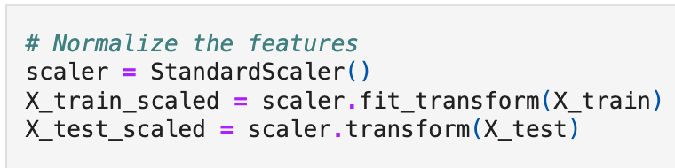
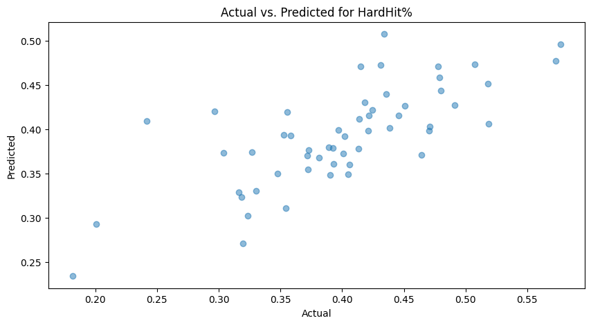

# MLB Bat Tracking Capstone

>Name: Jake Rood

This repository contains the work for my Data Analytics Capstone project for the Master of Science in Data Analytics program at Northwest Missouri State University.

The relationship between Major League Baseball's new bat tracking metrics, specifically bat speed and swing length, with traditional batting statistics is investigated using Python in this project.

## Report

A complete report accompanying this repository can be found at the following link: [Overleaf Report](https://www.overleaf.com/read/vhbhtpgtbcpm#5fbfbc)

## Data

The data used in this project was acquired from Baseball Savant and FanGraphs. Data includes all games from the 2024 Major League Baseball season through July 2, 2024.

[Statcast Bat Tracking](https://baseballsavant.mlb.com/leaderboard/bat-tracking?attackZone=&batSide=&contactType=&count=&dateStart=&dateEnd=2024-07-02&gameType=&groupBy=&isHardHit=&minSwings=1&minGroupSwings=1&pitchHand=&pitchType=&seasonStart=&seasonEnd=&team=&type=batter)

[Major League Batting Leaders](https://www.fangraphs.com/leaders/major-league?pos=all&stats=bat&lg=all&type=c%2C6%2C5%2C7%2C8%2C9%2C10%2C11%2C12%2C13%2C14%2C15%2C16%2C17%2C23%2C34%2C35%2C37%2C38%2C39%2C50%2C61%2C305%2C308%2C311&season=2024&month=1000&season1=2024&ind=0&qual=1&v_cr=202301&startdate=2024-03-01&enddate=2024-07-02&team=0)

## Prerequisites

1. Git
1. Python 3.7+ (3.11+ preferred)
1. VS Code Editor

## Before You Begin

1. Fork this starter repo into your GitHub.
1. Clone your repo down to your machine.

## Create a Python Virtual Environment

We will create a local Python virtual environment to isolate our project's third-party dependencies from other projects.

1. Open a terminal window in VS Code.
1. Use the built-in Python utility venv to create a new virtual environment named `.venv` in the current directory.

```shell
python3 -m venv .venv
```

Verify you get a new .venv directory in your project.
We use .venv as the name to keep it away from our project files. 

## Activate the Virtual Environment

In the same VS Code terminal window, activate the virtual environment. On MacOS:

```shell
source .venv/bin/activate
```

Verify you see the virtual environment name (.venv) in your terminal prompt.

## Install Dependencies into the Virtual Environment

We keep the list of third-party libraries needed in a file named requirements.txt.
Use the pip utility to install the libraries listed in requirements.txt into our active virtual environment. 

Make sure you can see the .venv name in your terminal prompt before running this command.

```shell
python3 -m pip install -r requirements.txt
```

## Data Cleaning

After the virtual enviorment is ready, the [Data Cleaning Notebook](https://github.com/jakerood/bat-tracking-capstone/blob/main/data-cleaning.ipynb) is opened in JupyterLab to begin cleaning the datasets. The following is performed during the data cleaning process:

* Merge the two datasets

* Create a new feature called `HR%`

* Remove redundant or unnecessary columns
* Filter out players with small sample sizes (less than 170 plate appearance)

* Save the cleaned dataset to CSV file

## Exploratory Data Analysis

Following the completion of data cleaning, exploratory data analysis (EDA) is performed within JupyterLab in the [EDA Notebook](https://github.com/jakerood/bat-tracking-capstone/blob/main/eda.ipynb). The following is performed during the EDA process:

* Describe the numeric data
* Generate histograms and box plots for each metric


* Visualize the relationship between bat speed and swing length

* Calculate correlation between bat-tracking metrics and traditional batting statistics


* Group batters into "High Bat Speed" or "Low Bat Speed" groups and "Long Swing" or "Short Swing" groups

* Generate violin plots comparing the swing groups for various metrics


## Machine Learning Model

Once exploratory data analysis is complete, machine learning is performed within JupyterLab in the [Machine Learning Notebook](https://github.com/jakerood/bat-tracking-capstone/blob/main/machine-learn.ipynb). The following is performed during the machine learning process:

* Use scikit-learn to split data into 80% training, 20% test sets

* Standardize average bat speed and swing length

* Employ a MultiOutputRegressor with LinearRegression as the base model for six target variables (HardHit%, Barrel%, HR%, Whiff%, K%, SLG)

* Use Matplotlib to visualize actual versus predicted results for each target variable

* Use model to predict statistics for example players


## Results

The research resulted in the following key insights.

### Average Bat Speed Correlation

There is a strong positive correlation between average bat speed and quality of contact metrics like HardHit%, EV, and Barrel%. Average bat speed also positively correlates with HR%, Whiff% and K%.


### Swing Length Correlation

Swing length's strongest correlation is a positive correlation with Whiff%. Like average bat speed, there is also a positive correlation with Barrel%, HardHit% and HR%. There is a negative, albeit fairly weak, correlation with batting average.


### Machine Learning Results

The machine learning model resulted in the following equations for the six target variables (NOTE: average bat speed and swing length are standardized):


The following shows how the model performed in regards to each target variable:


HardHit% was the most predictive variable. Barrel% and HR% also demonstrated decent predictive ability.

## References

[Master of Science in Data Analytics - Northwest Missouri State University](https://online.nwmissouri.edu/programs/technology/master-of-science-data-analytics/)

[Baseball Savant](https://baseballsavant.mlb.com/)

[FanGraphs](https://www.fangraphs.com/)
